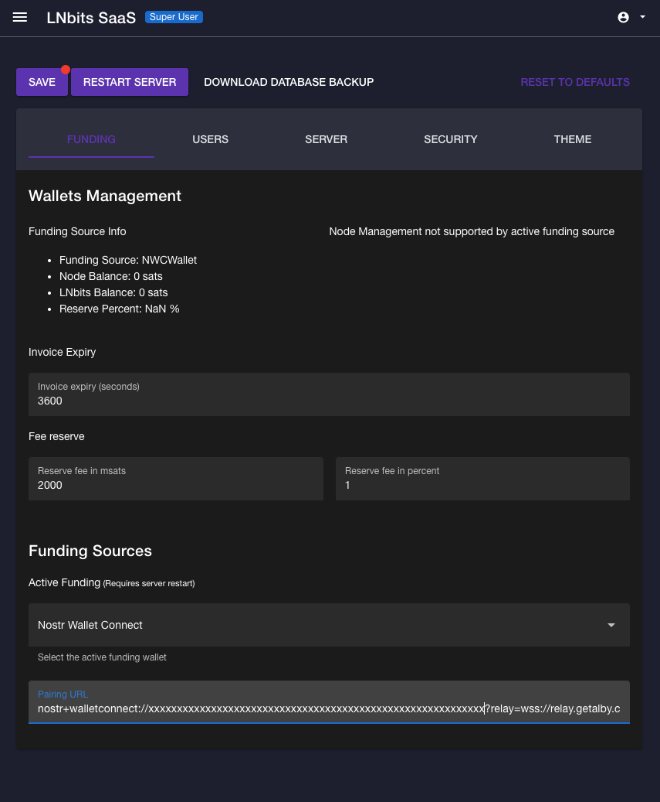

# Adding AlbyHub as a Funding Source for LNbits

In AlbyHub:
1. Click "Connect" to LNbits
1. Set the app's wallet permissions (full access is recommended), click "Next"
1. Copy the pairing secret below the QR code

In LNbits:
<!-- image here -->

1. As an admin user, open LNbits and open the "Server" > "Funding" menu
1. In the funding sources section, select "Nostr Wallet Connect"
1. Paste the pairing secret copied from AlbyHub
1. Click "Save", then "Restart Server" and wait a moment for LNbits to restart

LNbits is now connected to AlbyHub